# dbt Core Day 1 - Loading Sample Data into your Cloud Provider

To begin working through our tutorial for dbt core in Shipyard, we need to setup an example dataset to work with. The steps in this guide will follow along with the steps in dbt's tutorial, however we will work through setting up the following cloud data warehouses:
* Bigquery
* Databricks
* Redshift 
* Snowflake

Before getting into the steps of setting up the different cloud data warehouses, please download the sample files that we will use for this tutorial [here](https://drive.google.com/drive/folders/15gLVxj5-aMee0CRZ7H9Ht-S9CkZ1jB6y?usp=sharing).

<Tabs
groupId="code-inputs"
defaultValue="write"
values={[
{label: 'Bigquery', value: 'bigquery'},
{label: 'Databricks', value: 'databricks'},
{label: 'Redshift', value: 'redshift'},
{label: 'Snowflake', value: 'snowflake'}
]}>

:::note
This tutorial assumes that you have an account created for your chosen data warehouse. If not, please go create an account and begin the tutorial from there.
:::

<TabItem value="bigquery">
### Setting up demo project
1. Navigate to the [BigQuery Console](https://console.cloud.google.com/bigquery?project=dbt-demos)
2. Click to access the **Project Browser** on the top left corner of your screen.

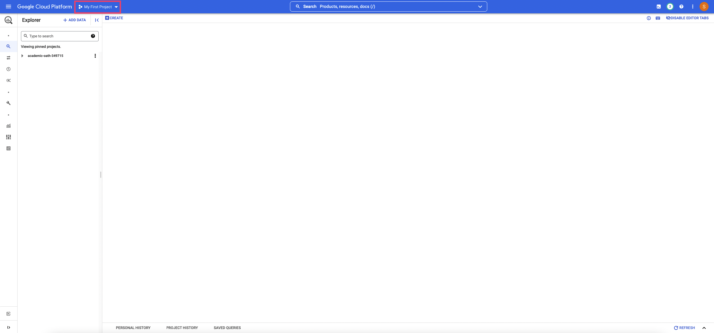

3. On the top right of the Project Browser, click New Project. This will redirect you to put information in about your new project
4. Under **Project Name**, enter dbt-demos
5. Organization and Location can stay at their default values.
6. Click **Create***.

### Upload Data
1. Locate the dbt-demos project that we created on the left side bar. 
2. Click the 3 dots and choose **Create dataset**

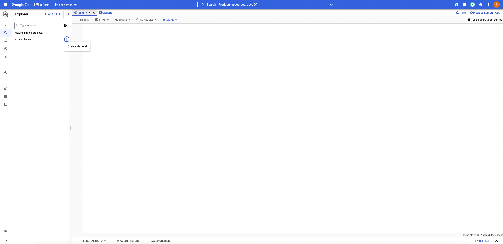

4. For **Dataset ID**, enter 538_football.
5. Click **Create Dataset**.
6. Expand the dbt-demos project on the left sidebar by clicking the arrow. Locate the 538_football dataset. Click the 3 dots and choose **Create Table**.
7. Under **Create Table from**, choose Upload.
8. Under **File Format**, choose CSV.
9. Project and Dataset should automatically be set to dbt-demos and 538_football respectively. 
10. Under table, enter `stg_football_matches`
11. Check box for **Auto Detect**.

Your settings should look like this: 

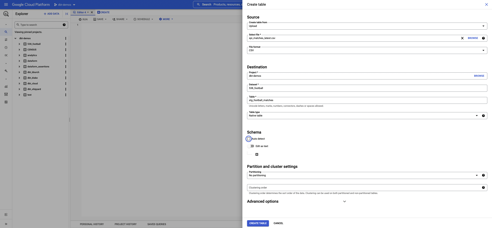

12. Click **Create Table**.
13. Repeat the above steps with the second CSV file, however name the table `stg_football_rankings`.

You should be able to see the two tables you created under the **538_football** dataset on the left sidebar as seen in this photo:

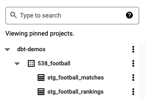.

<TabItem value="snowflake">
### Creating demo database
1. On the top left corner of your Snowflake screen, click on the **Databases** logo. 

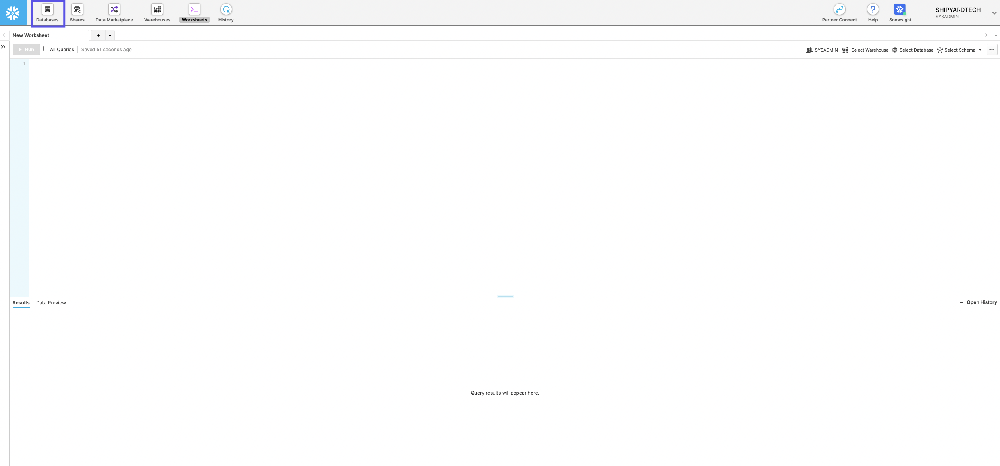

2. Click **Create** on the databases screen to create our demo database.
3. Under **name**, enter dbt_demo. Click Finish

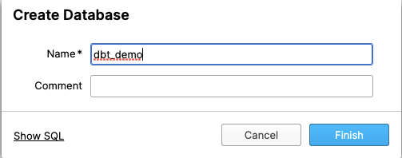

4. You should see the dbt_demo database listed. Click on it to navigate into the database.

![](undefined/docs/.gitbook/assets/Snowflake_to_demo_db.gif

### Load Data
1. Click **Create** on the top left of the screen to create a table inside our database.
2. Under **Table Name**, enter stg_football_rankings.
3. We will need to manually input our schema for the CSV. This first table takes 7 columns. Click the **Add** button to create the first column in the schema.
4. Under the **Name** column, enter rank.
5. Under the **Type** column, select integer. We will need to follow this process for the remaining six columns. The information for those are as follows: 
| Name | Type |
|-|-|
| prev_rank | Integer |
| name | String |
| league | String |
| off | Float |
| def | Float |
| spi | Float |

Your final table setup should look like this: 

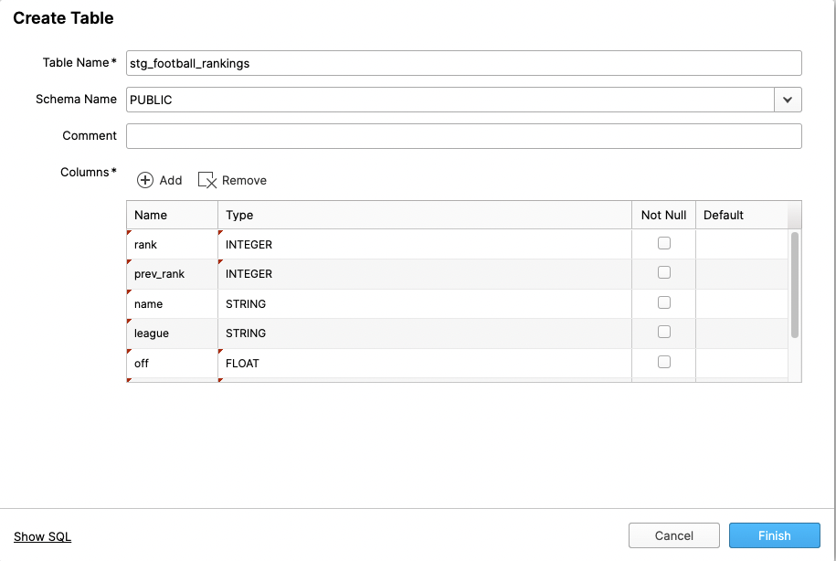

6. Click **Finish**. You should see the new table **stg_football_rankings** in your dbt_demo database now

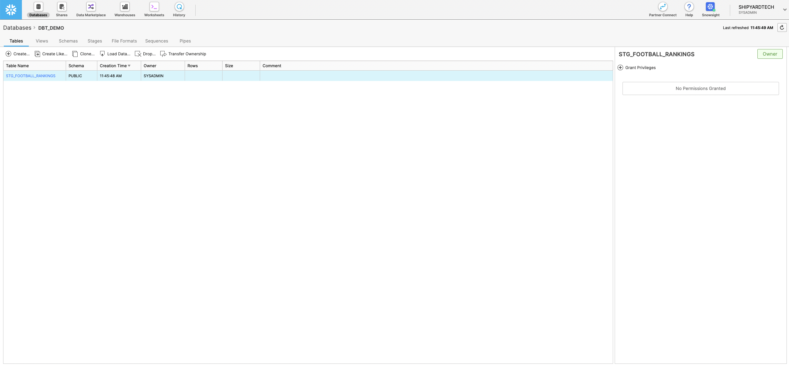

7. We will need to repeat the steps above for our second table with the following settings:
   1. **Table Name**: stg_football_matches
   2. **Schema**: 
| Name | Type |
|-|-|
| season | Integer |
| date | Date |
| league_id | Integer |
| league | String |
| team1 | String |
| team2 | String |
| spi1 | Float |
| spi2 | Float |
| prob1 | Float |
| prob2 | Float |
| probtie | Float |
| proj_score1 | Float |
| proj_score2 | Float |
| importance1 | Float |
| importance2 | Float |
| score1 | Integer |
| score2 | Integer |
| xg1 | Float |
| xg2 | Float |
| nsxg1 | Float |
| nsxg2 | Float |
| adj_score1 | Float |
| adj_score2 | Float |

You should be able to see both tables listed under your dbt_demo database now

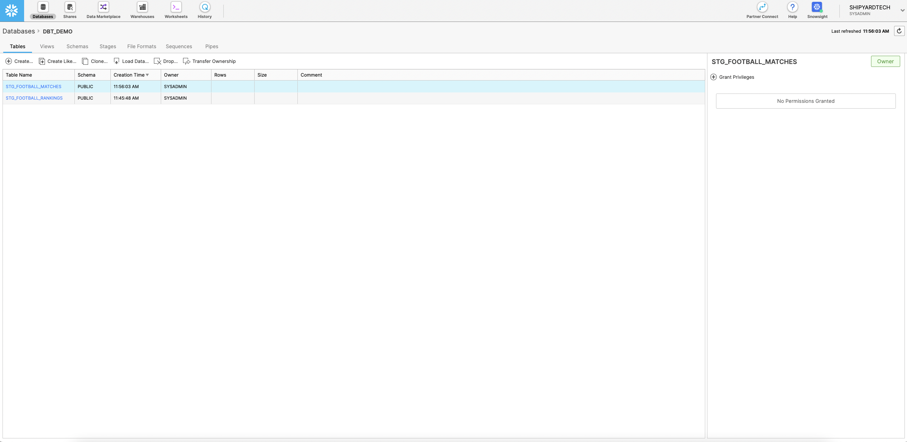

<TabItem value="databricks">

:::note
This tutorial is completed using Databrick's Community Edition
:::

1. Navigate to the left sidebar and select data. This will open up the sidebar to look at the data currently stored in Databricks.
2. Click **Create Table**. This will take you to the Create New Table page.
3. Under Files, click the box to browse your files and select `spi_matches_latest.csv`.

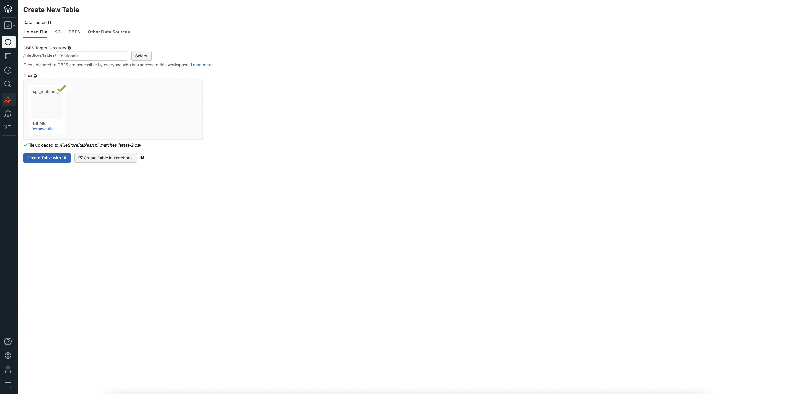

4. Click **Create Table with UI**
5. Select Cluster to preview table. Click **Preview Table**. This will give you the ability to specify options for the table.

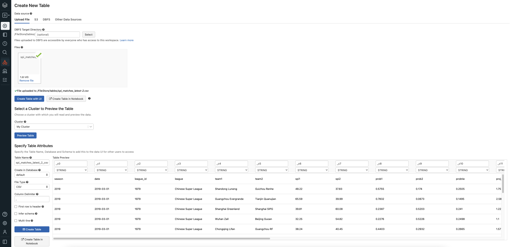

6. Under **Table Name**, enter stg_football_matches
7. Under **Create in Database**, feel free to change to any database you like. I will leave mine at default for simplicity sake.
8. Under **File Type**, make sure CSV is selected.
9. Under **Column Delimiter**, make sure `,` is in the box.
10. Check the box for **First row is header**.
11. Check the box for **Infer schema**.
12. Click **Create Table**. This will redirect you to a page to see the table that you just created:

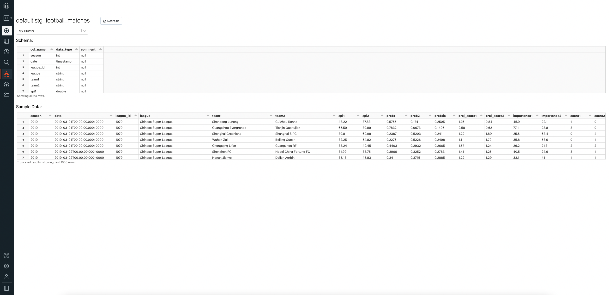

13. Click **Data** on the left sidebar to open the data sidebar. Click **Create Table**.
14. Repeat steps 3-12 with the following changes:
    1.  Under Files, click the box to browse your files and select `spi_global_rankings.csv`.
    2.  Under **Table Name**, enter stg_football_rankings.
15. After repeating those steps with the indicated changes, your resulting page should look like this:

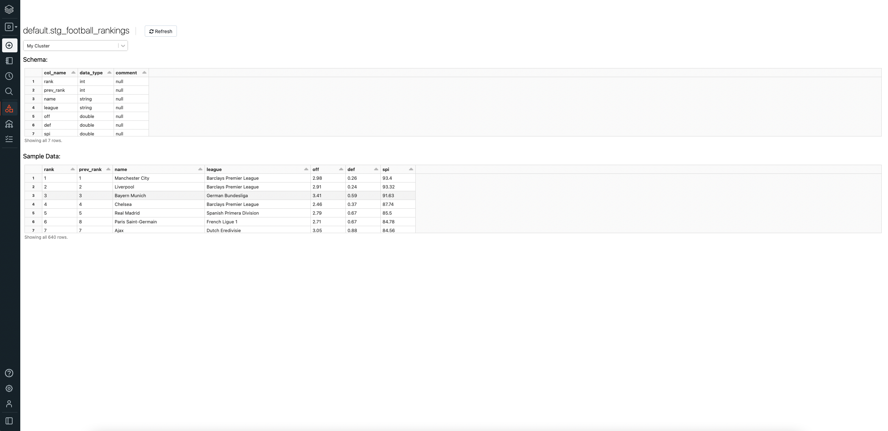