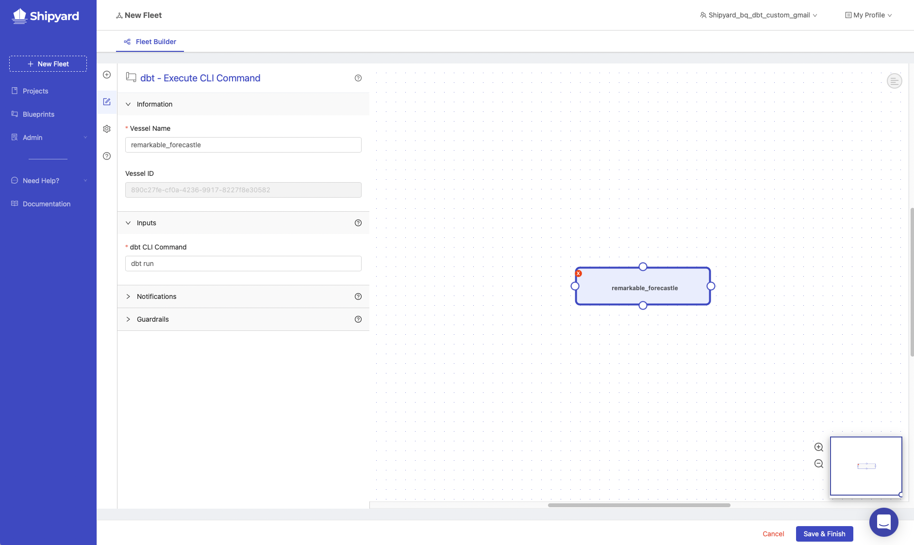
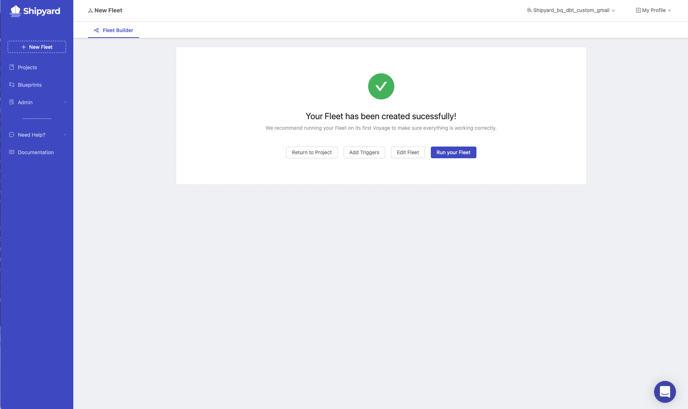

# dbt Core Day 2 - Setting Up dbt

In day 2 of the dbt core setup series, we are going to discuss the setup process for dbt for each specific cloud data warehouse that we discussed on day one. We will also setup our sql models to be ready to run on day 3 of the series tomorrow. Before we get into the guide, there are some prerequisite items that need to be ready to go before we can begin:
    * Complete [Day 1](link here) of the dbt core series
    * Create a [Github Account] if you do not currently have one.
    * Have a text editor available. I recommend [Atom](https://atom.io/) or [Visual Studio Code](https://code.visualstudio.com/).

### Get Initial dbt Project Setup from Github
1. Fork [this repository](https://github.com/smjohnsonShipyard/dbt_test). The repository contains the beginning state of a dbt project.
2. Open `dbt_project.yml` in your text editor. 


### dbt Project File Setup
1. Change the project name to soccer_538.
2. Change the profile to soccer_538. 
3. Change model name to soccer_538.
4. Save your changes

### Profile Setup

<Tabs
groupId="code-inputs"
defaultValue="write"
values={[
{label: 'Bigquery', value: 'bigquery'},
{label: 'Databricks', value: 'databricks'},
{label: 'Redshift', value: 'redshift'},
{label: 'Snowflake', value: 'snowflake'}
]}>

<TabItem value="bigquery">
1. Open `profiles.yml`
2. Update the file to this:

```
soccer_538: 
  target: dev
  outputs:
    dev:
      type: bigquery
      method: service-account
      project: dbt-demos # Replace this with your project id
      dataset: dbt_shipyard # Replace this with dbt_your_name, e.g. dbt_bob
      threads: 4
      timeout_seconds: 300
      location: US
      priority: interactive
      keyfile: "{{ env_var('BIGQUERY_KEYFILE') }}"
```
You'll note that the keyfile above is denoted as a environment variable. We will send that in as an environment variable inside of Shipyard to protect it from being seen. 
3. Create a new file in your root directory of your dbt project called `execute_dbt.py`
4. Paste this code block for the content of execute_dbt.py: 

```
import subprocess
import os
import json

bigquery_credentials = os.environ.get('BIGQUERY_CREDS')
directory_of_file = os.path.dirname(os.path.realpath(__file__))
dbt_command = os.environ.get('dbt_command', 'dbt run')

os.chdir(directory_of_file)
if not bigquery_credentials or not bigquery_credentials == 'None':
    bigquery_credentials = json.loads(bigquery_credentials)
    with open('bigquery_creds.json', 'w') as outfile:
        json.dump(bigquery_credentials, outfile)

subprocess.run(['sh', '-c', dbt_command], check=True)
```
5. Commit and push your changes to Github.


<TabItem value="snowflake">
1. Open `profiles.yml`
2. Update the file to this: 

```
soccer_538:
  target: dev
  outputs:
    dev:
      type: snowflake
      account: "{{ env_var('snowflake_trial_account') }}"
      user: dbt_user
      password: "{{ env_var('dbt_user_password') }}"
      role: dbt_dev_role
      database: dbt_hol_dev
      warehouse: dbt_dev_wh
      schema: soccer_538
      threads: 200
```

3. Create a new file in your root directory of your dbt project called `execute_dbt.py`
4. Paste this code block for the content of execute_dbt.py: 

```
import subprocess
import os
import json

dbt_command = os.environ.get('DBT_COMMAND', 'dbt run')

subprocess.run(['sh', '-c', dbt_command], check=True)
```
5. Commit and push your changes to Github.


<TabItem value="databricks">
1. Open `profiles.yml`
2. Update the file to this: 

```
soccer_538:
    target: dev
    outputs:
        dev:
        type: databricks
        schema: [schema name]
        host: "{{ env_var('databricks_host') }}"
        http_path: [/sql/your/http/path]
        token: "{{ env_var('databricks_token') }}"
```
3. Create a new file in your root directory of your dbt project called `execute_dbt.py`
4. Paste this code block for the content of execute_dbt.py: 

```python
import subprocess
import os
import json

dbt_command = os.environ.get('dbt_command', 'dbt run')

subprocess.run(['sh', '-c', dbt_command], check=True)
```
5. Commit and push your changes to Github.


<TabItem value="redshift">
1. Open `profiles.yml`
2. Update the file to this: 

```
soccer_538:
    target: dev
    outputs:
        dev:
            type: redshift
            host: hostname.region.redshift.amazonaws.com
            user: "{{ env_var('redshift_username') }}"
            password: "{{ env_var('redshift_password') }}"
            port: 5439
            dbname: analytics
            schema: analytics
            threads: 4
            keepalives_idle: 240 # default 240 seconds
            connect_timeout: 10 # default 10 seconds
            ra3_node: true 
    ```

3. Create a new file in your root directory of your dbt project called `execute_dbt.py`
4. Paste this code block for the content of execute_dbt.py: 

```python
import subprocess
import os
import json

dbt_command = os.environ.get('dbt_command', 'dbt run')

subprocess.run(['sh', '-c', dbt_command], check=True)
```
5. Commit and push your changes to Github.


Now that we have our sample data setup in our cloud data warehouse and dbt processes setup. We need to write our example models for the dbt job to run. 

### dbt Models
1. Navigate into the models folder in your text editor. There should be a subfolder under models called example. Delete that subfolder and create a new folder called 538_football.
2. Create two subfolders inside 538 football called staging and marts.


3. Inside the staging folder, create a file called stg_football_matches.sql
4. Paste the following code into that file:
<Tabs
groupId="code-inputs"
defaultValue="write"
values={[
{label: 'Bigquery', value: 'bigquery'},
{label: 'Databricks', value: 'databricks'},
{label: 'Redshift', value: 'redshift'},
{label: 'Snowflake', value: 'snowflake'}
]}>

<TabItem value="bigquery">
SELECT * FROM `dbt-demos.538_football.stg_football_matches`

<TabItem value="databricks">

<TabItem value="redshift">
select * from soccer.stg_football_matches

<TabItem value="snowflake">
select * from "DBT_HOL_DEV"."PUBLIC"."STG_FOOTBALL_MATCHES"

5. Inside the staging folder, create a file called stg_football_rankings.sql
6. Paste the following code into that file:

<Tabs
groupId="code-inputs"
defaultValue="write"
values={[
{label: 'Bigquery', value: 'bigquery'},
{label: 'Databricks', value: 'databricks'},
{label: 'Redshift', value: 'redshift'},
{label: 'Snowflake', value: 'snowflake'}
]}>

<TabItem value="bigquery">
SELECT * FROM `dbt-demos.538_football.stg_football_rankings`

<TabItem value="databricks">
**NEED ACCESS TO DATABRICKS FOR QUERY**

<TabItem value="redshift">
select * from `soccer.stg_football_rankings`

<TabItem value="snowflake">
select * from `"DBT_HOL_DEV"."PUBLIC"."stg_football_rankings"`

7. In the staging folder, add a file called schema.yml.
8. In this file, paste the following information:

```
version: 2

models:
  - name: stg_football_matches
    description: Table from 538 that displays football matches and predictions about each match.

  - name: stg_football_rankings
    description: Table from 538 that displays a teams ranking worldwide
```
:::note
This is where you can add tests later.
:::

9.  In the marts folder, create a file called mart_football_information.sql
10. Paste the following code into that file:

```sql
with 
  qryMatches as (
    SELECT * FROM {{ ref('stg_football_matches') }} where league = 'Barclays Premier League'
    ),
  qryRankings as (
    SELECT * FROM {{ ref('stg_football_rankings') }} where league = 'Barclays Premier League'
  ),

  qryFinal as (
    select
      qryMatches.season,
      qryMatches.date,
      qryMatches.league,
      qryMatches.team1,
      qryMatches.team2,
      team_one.rank as team1_rank,
      team_two.rank as team2_rank
    from 
      qryMatches join
      qryRankings as team_one on 
        (qryMatches.team1 = team_one.name) join
      qryRankings as team_two on 
        (qryMatches.team2 = team_two.name)
  )

select * from qryFinal
```

11. In the marts folder, add a file called schema.yml
12. In this file, paste the following:

```
version: 2

models: 
  - name: mart_football_information
    description: Table that displays football matches along with each team's world ranking.
```


We are ready to move into Shipyard to run our process. First, you will need to create a developer account on Shipyard.

### Create Developer Shipyard Account

1. Navigate to Shipyard's sign-up page [here](https://app.shipyardapp.com/auth/signup?ref=header).


2. Sign up with your email address and organization name.
3. Connect to your Github account. Follow the steps to do that in this [guide](https://www.shipyardapp.com/blog/automate-deployment-github-code/). After connecting your Github account, you'll be ready to create your first blueprint.

### Creating dbt Core Blueprint
1. On the sidebar of Shipyard's website, click **Blueprints**.
2. Click **Add Blueprint** on the top right of your page.
3. Select **Python**.
4. Under blueprint variables, click **Add Variable**.
5. Under display name, enter `dbt CLI Command`.
6. Under reference name, enter `dbt_command`.
7. Under default value, enter dbt run.
8. Click the check box for required
9. Under placeholder, enter `Enter the command for dbt`.
10. Click Next
11. Click **Git**.


12. Select the repository where your dbt files sit.
13. Click the source that you want the files pulled from. Generally **main** or **master**.
14. Under file to run, enter execute_dbt.py
15. Under **Git Clone Location**, select the option for `Unpack into Current Working Directory`.
16. Click **Next Step** on the bottom right of the screen.
17. Next to **Environment Variable**, click the plus sign to add an environment variable.

### Add Environment Variables
The environment variables that need to be added will vary based on the cloud database that you use. Please click your database below to continue:


<Tabs
groupId="code-inputs"
defaultValue="write"
values={[
{label: 'Bigquery', value: 'bigquery'},
{label: 'Databricks', value: 'databricks'},
{label: 'Redshift', value: 'redshift'},
{label: 'Snowflake', value: 'snowflake'}
]}>


<TabItem value="bigquery">
| Variable Name     | Value                    |
|-------------------|--------------------------|
| BIGQUERY_CREDS   | <BQ credentials>          |
| BIGQUERY_KEYFILE | ./bigquery_creds.json     |
| DBT_PROFILES_DIR | .                         |


<TabItem value="databricks">
| Variable Name     | Value                    |
|-------------------|--------------------------|
| DBT_PROFILES_DIR  | .                        |
| databricks_host   | <host from databricks>   |
| databricks_token  | <token from databricks>  |

<TabItem value="redshift">
| Variable Name     | Value                    |
|-------------------|--------------------------|
| DBT_PROFILES_DIR  | .                        |
| redshift_username | <username from redshift> |
| redshift_password | <password from redshift> |


<TabItem value="snowflake">
| Variable Name           | Value                    |
|-------------------------|--------------------------|
| snowflake_trial_account | <snowflake account name> |
| dbt_user_password       | <username from redshift> |
| DBT_PROFILES_DIR        | .                        |


### Python Packages
1. Click the plus sign next to **Python Packages**.
2. In the **Name** field, enter dbt. In the version field, enter `==0.21.1`.
3. Click the plus sign to add a second package.
4. In the **Name** field, enter MarkupSafe. In the version field, enter `==2.0.1`.
5. Click **Next**.

### Blueprint Settings
1. Under **Blueprint Name**, enter `dbt - Execute CLI Command`.
2. Under synopsis, enter `This blueprint runs a dbt core command.`
3. Click **Save**.
4. In the top right of your screen, click **Use this Blueprint**. This will take you over to the Fleet Builder and prompt you to select a project.

### Build dbt Core Fleet
1. On the **Select a Project** prompt, click the drop down menu to expand it and select `Create a New Project`.
2. Under project name, enter `dbt Core Testing`.
3. Under timezone, enter your timezone.


4. Click **Create Project**. 
5. The Select a Project prompt will re-appear with the dbt Core Testing project selected. If it isn't selected, use the drop down to select it. 
6. Click **Select Project**. This will create a new fleet in the new project. The fleet builder will now be on your page with one vessel located inside of the fleet.
7. Click on the vessel in the fleet builder and you will see the settings for the vessel pop up on the left of your screen.



8. Under Vessel Name, enter dbt Core CLI Command.
9. Under dbt CLI Command, enter dbt debug.
10. Click the gear on the sidebar to open Fleet Settings.


11. Under Fleet Name, enter dbt Core. 
12. Click **Save & Finish** on the bottom right of your screen.
13. This should take you to a page showing that your fleet was created successfully.



14. Click **Run Your Fleet**. This will take you over to the Fleet Log.


15. You can click on the bar to get the output from your run. 


If you scroll to the top of the output, you will see that the environment variables that were put in during the Blueprint creation process are hidden from the user.

